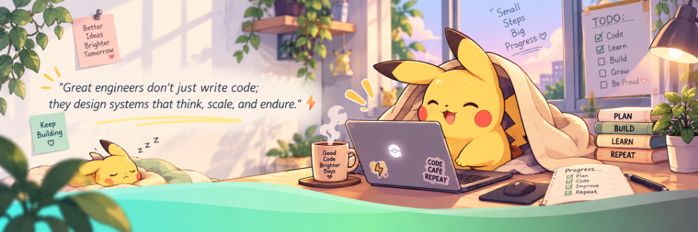

<div align="center">

<!-- HERO BANNER -->
<a href="https://github.com/Salimansari369">
  
</a>

<br><br>

<!-- JETBRAINS MONO ANIMATED TYPING BANNER -->
<a href="https://github.com/Salimansari369">
  
</a>

<br>

<!-- CTA BADGES & RESUME DOWNLOAD -->
<p align="center">
  <a href="resume.pdf" download="Salim_Ansari_Resume.pdf">
    
  </a>
  &nbsp;
  <a href="https://linkedin.com/in/">
    
  </a>
  &nbsp;
  <a href="mailto:salimansari369@users.noreply.github.com">
    
  </a>
  &nbsp;
  
  &nbsp;
  <a href="https://github.com/Salimansari369">
    
  </a>
</p>

</div>

---

# 👨‍💻 About Me & Academic Profile

<table>
<tr>
<td width="55%" valign="top">

### ⚡ Transforming Data & Neural Nets into Impactful Systems

Hi, I'm **Salim Ansari**. I build software that sits at the intersection of **autonomous artificial intelligence, machine learning, and high-throughput web systems**.

* 🎓 **Degree:** B.Tech in Computer Science & Engineering
* 🤖 **Specialization:** Artificial Intelligence & Machine Learning (AI & ML)
* 🏫 **Campus:** **Symbiosis Institute of Technology (SIT), Nagpur**
* 🏛️ **University:** **Symbiosis International (Deemed University)**
* 💼 **Industry Experience:** Software & AI Engineering Intern (**Maincrafts**)
* 📄 **Research:** Published Academic Research Copy (**Springer**)
* 🚀 **Core Focus:** Multi-Agent LLM Orchestration, Agentic Workflows, Applied ML Benchmarking, and Scalable Backend Systems.
* 💡 **Philosophy:** *"I started coding seriously because I wanted to build intelligent systems I wished existed."*

</td>
<td width="45%" align="center" valign="middle">

<!-- 3D Developer Looping Animation -->


</td>
</tr>
</table>

```python
class SalimAnsari:
    def __init__(self):
        self.name = "Salim Ansari"
        self.role = "AI/ML Systems Architect & Full-Stack Developer"
        self.education = "B.Tech CSE (AI & ML) @ Symbiosis SIT Nagpur"
        self.university = "Symbiosis International (Deemed University)"
        self.location = "Nagpur, Maharashtra, India"

        self.core_domains = [
            "Agentic AI & Multi-Agent Workflows",
            "Generative AI & LLM Systems (RAG / DocGen)",
            "Machine Learning & Statistical Data Modeling",
            "Full-Stack Web Architectures (Flask, Node.js, Gradio)",
            "High-Throughput RESTful Microservices & Distributed APIs"
        ]

        self.weapons_of_choice = ["Python", "PyTorch", "Gradio", "Node.js", "Flask", "JavaScript", "SQL"]
```

<div align="center">

| 🏛️ University | 🏫 Campus | 🎓 Degree | 🤖 Specialization |
| :---: | :---: | :---: | :---: |
| **Symbiosis International (Deemed University)** | **Symbiosis Institute of Technology (SIT)** | **B.Tech CSE** | **Artificial Intelligence & Machine Learning** |

</div>

---

## `~/` whoami

```console
$ cat about.txt
```

Hi, I'm **Salim Ansari**. I build things that sit somewhere between machine learning and the web, and I solve complex engineering challenges when neither of those is cooperating.

- 🤖 Currently building **[Automated Research Review Assistant](https://github.com/Salimansari369/Automated-Research-Review-Assistant)** and **[MediLinks](https://github.com/Salimansari369/medilink)**
- 🏢 Built **[CampusCare](https://github.com/Salimansari369/Hack-o-Week-odd-5sem-2026-2027)** (Campus Maintenance REST API) & **[NOIRÉ](https://github.com/Salimansari369/NOIRE--Full-stack-Task-1-)** (Luxury Web Experience)
- 📊 Benchmarked supervised ML models & unsupervised clustering algorithms across 5th semester coursework
- ⚡ Deepening **Autonomous Agentic AI, LangChain/LangGraph, and Production LLM Deployment**

---

# 🏆 Experience & Achievements

<div align="center">

| Milestone | Category | Organization / Publisher | Highlights |
|:---:|:---:|:---:|:---|
| 📄 **Published Research Copy** | Academic Publication | **Springer** | Deep Learning, Machine Learning & Applied Computing |
| 💼 **Software / AI Engineering Internship** | Industry Experience | **Maincrafts** | Full-Stack web integration, software lifecycle, and practical engineering |
| 🤖 **Agentic Literature Synthesis Platform** | AI Architecture | **Symbiosis SIT Nagpur** | Autonomous multi-agent pipeline synthesizing academic papers into reports |
| 🏆 **Hack-o-Week 5th Sem Master** | University Lab Portfolio | **Academic Labs** | 5 engineering challenges: REST APIs, Linear Algebra for ML, and Clustering |
| ⚡ **JavaScript Full Practical Suite** | Web Engineering Labs | **Curriculum Labs** | 9 end-to-end practicals spanning DOM, storage persistence, regex, and UI modules |

</div>

---

# ⚔️ Competitive Programming & Problem Solving

<div align="center">

<p align="center">
  <a href="https://leetcode.com/">
    
  </a>
  &nbsp;&nbsp;
  <a href="https://www.geeksforgeeks.org/">
    
  </a>
  &nbsp;&nbsp;
  <a href="https://www.codechef.com/">
    
  </a>
  &nbsp;&nbsp;
  <a href="https://www.hackerrank.com/">
    
  </a>
</p>

</div>

---

<div align="center">

## `~/` toolbox


</div>

---

<div align="center">

## `~/` skill radar

<table>
<tr>
<td width="50%" align="center" valign="middle">

<!-- Self-rated radar generated by scripts/radar.py -->
<picture>
  <source media="(prefers-color-scheme: dark)"  srcset="assets/radar-dark.svg">
  <source media="(prefers-color-scheme: light)" srcset="assets/radar-light.svg">
  
</picture>

</td>
<td width="50%" align="center" valign="middle">

<!-- Live radar built from real language byte counts across public repos -->
<picture>
  <source media="(prefers-color-scheme: dark)"  srcset="assets/radar-langs-dark.svg">
  <source media="(prefers-color-scheme: light)" srcset="assets/radar-langs-light.svg">
  
</picture>

</td>
</tr>
</table>

</div>

---

<div align="center">

## `~/` contribution calendar

<!-- 3D isometric calendar -->


<br><br>

<!-- ROCKET / JET HEATMAP GAME (REPLACING THE SNAKE GAME) -->
### 🚀 Supersonic Jet Heatmap Interceptor
> *A supersonic stealth jet patrols the real contribution grid, blasting high-velocity build days with laser & kinetic pulses!*

<p align="center">
  
</p>

</div>

---

<div align="center">

## `~/` the numbers

<!-- Self-hosted stats card generated by scripts/cards.py -->
<picture>
  <source media="(prefers-color-scheme: dark)"  srcset="assets/card-stats-dark.svg">
  <source media="(prefers-color-scheme: light)" srcset="assets/card-stats-light.svg">
  
</picture>

<br>


<br><br>


</div>

---

<div align="center">

## `~/` selected work

<!-- Cards generated by scripts/cards.py from assets/projects.json -->
<table>
<tr>
<td width="50%">
  <a href="https://github.com/Salimansari369/Automated-Research-Review-Assistant">
    <picture>
      <source media="(prefers-color-scheme: dark)"  srcset="assets/card-Automated-Research-Review-Assistant-dark.svg">
      <source media="(prefers-color-scheme: light)" srcset="assets/card-Automated-Research-Review-Assistant-light.svg">
      
    </picture>
  </a>
</td>
<td width="50%">
  <a href="https://github.com/Salimansari369/medilink">
    <picture>
      <source media="(prefers-color-scheme: dark)"  srcset="assets/card-medilink-dark.svg">
      <source media="(prefers-color-scheme: light)" srcset="assets/card-medilink-light.svg">
      
    </picture>
  </a>
</td>
</tr>
<tr>
<td width="50%">
  <a href="https://github.com/Salimansari369/Hack-o-Week-odd-5sem-2026-2027">
    <picture>
      <source media="(prefers-color-scheme: dark)"  srcset="assets/card-Hack-o-Week-odd-5sem-2026-2027-dark.svg">
      <source media="(prefers-color-scheme: light)" srcset="assets/card-Hack-o-Week-odd-5sem-2026-2027-light.svg">
      
    </picture>
  </a>
</td>
<td width="50%">
  <a href="https://github.com/Salimansari369/NOIRE--Full-stack-Task-1-">
    <picture>
      <source media="(prefers-color-scheme: dark)"  srcset="assets/card-NOIRE--Full-stack-Task-1--dark.svg">
      <source media="(prefers-color-scheme: light)" srcset="assets/card-NOIRE--Full-stack-Task-1--light.svg">
      
    </picture>
  </a>
</td>
</tr>
</table>

<sub>

| project | category | description | stack |
|---|---|---|---|
| **[Automated Research Review Assistant](https://github.com/Salimansari369/Automated-Research-Review-Assistant)** | Autonomous AI | Multi-Agent literature discovery, citation analysis & formatted docx generation | `Python` `Gradio` `Agentic AI` `LLMs` |
| **[MediLinks](https://github.com/Salimansari369/medilink)** | Healthcare Portal | Doctor appointment reservation engine with input validation & Node server | `JavaScript` `Node.js` `HTML5` `CSS3` |
| **[CampusCare](https://github.com/Salimansari369/Hack-o-Week-odd-5sem-2026-2027)** | Facility REST API | Campus equipment and infrastructure ticket management microservice | `Python` `Flask` `SQLite` `REST` |
| **[NOIRÉ](https://github.com/Salimansari369/NOIRE--Full-stack-Task-1-)** | Luxury Web | High-fashion editorial perfume landing experience with ambient glow effects | `Semantic HTML5` `CSS Grid` `UI/UX` |

</sub>

</div>

---

# 📊 Additional Analytics & Telemetry

<div align="center">

<!-- Neon Radical Theme Stats Cards -->


<br><br>

<!-- Streak Stats -->


<br><br>

<!-- Contribution Activity Graph in React Blue Theme -->


<br><br>

<!-- Daily Inspirational Tech Quote Widget -->


</div>

---

# 🎯 2026–2027 Engineering Quests & Milestones

<div align="center">

| Quest / Objective | Technical Domain | Status |
|:---|:---:|:---:|
| 🤖 **Deploy Scaled Multi-Agent Production Systems** | Agentic AI / LLM Orchestration | 🚀 In Progress |
| 🧠 **Deepen Transformer Architectures & LLM Fine-Tuning** | Deep Learning / AI Research | 🚀 In Progress |
| ⚡ **Architect High-Throughput Event-Driven Microservices** | Distributed Backend Systems | 🎯 Targeted |
| 📄 **Publish Follow-Up Research in Top Applied AI Venues** | Academic AI Research | 🔄 Active |
| 🏆 **Compete & Win in National / Global Hackathons** | Innovation & Engineering | 🚀 Active |
| 💼 **Secure an Elite AI Engineer / Full-Stack Role** | Career & Industry | 🎯 Targeted |

</div>

---

# 💡 Coding Philosophy

```javascript
while (alive) {
    learn();
    architect();
    build();
    solveComplexProblems();
    collaborate();
    repeat();
}
```

<div align="center">

### **Learn • Architect • Build • Scale**

</div>

---

# 📬 Connect With Me

<div align="center">

<p align="center">
  <a href="mailto:salimansari369@users.noreply.github.com">
    
  </a>
  &nbsp;&nbsp;
  <a href="https://www.linkedin.com/in/">
    
  </a>
  &nbsp;&nbsp;
  <a href="https://github.com/Salimansari369">
    
  </a>
  &nbsp;&nbsp;
  <a href="https://leetcode.com/">
    
  </a>
  &nbsp;&nbsp;
  <a href="https://www.codechef.com/">
    
  </a>
  &nbsp;&nbsp;
  <a href="https://www.geeksforgeeks.org/">
    
  </a>
  &nbsp;&nbsp;
  <a href="https://www.hackerrank.com/">
    
  </a>
</p>

<br>

<p align="center">
  <a href="resume.pdf" download="Salim_Ansari_Resume.pdf">
    
  </a>
</p>

<br>

<sub>`01110100 01101000 01100001 01101110 01101011 01110011 00100000 01100110 01101111 01110010 00100000 01110011 01100011 01110010 01101111 01101100 01101100 01101001 01101110 01100111`</sub>

<br><br>

<p align="center">
  
</p>

</div>
